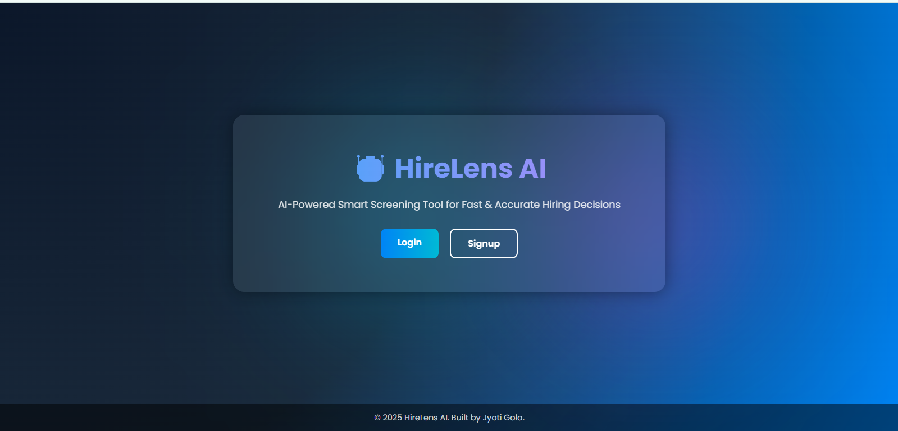
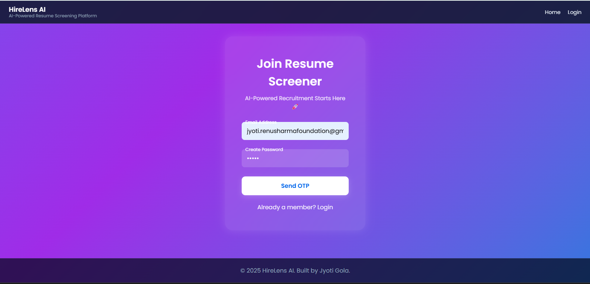
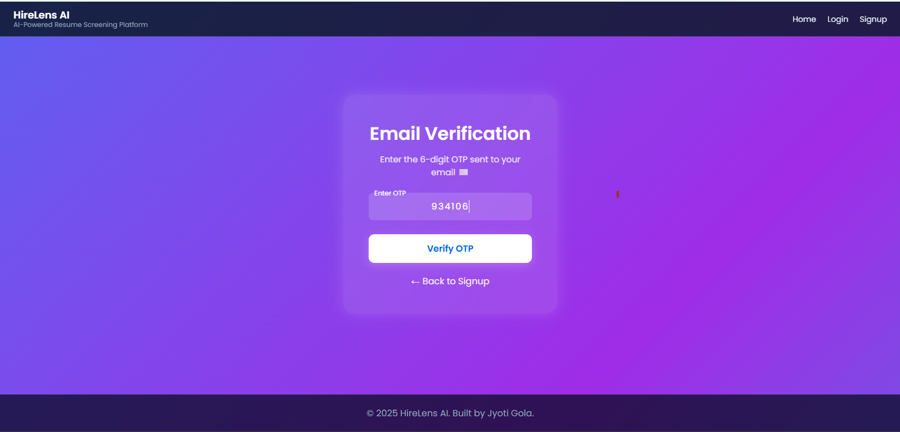
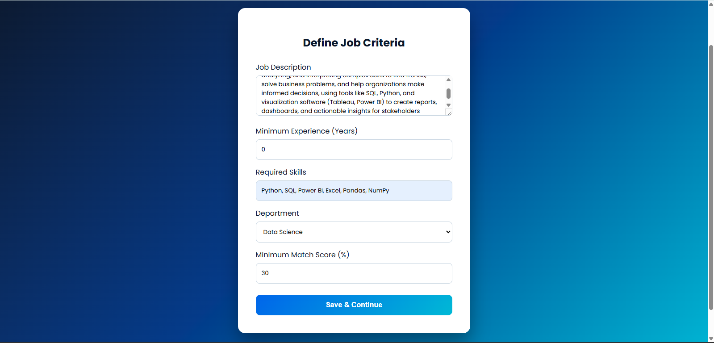
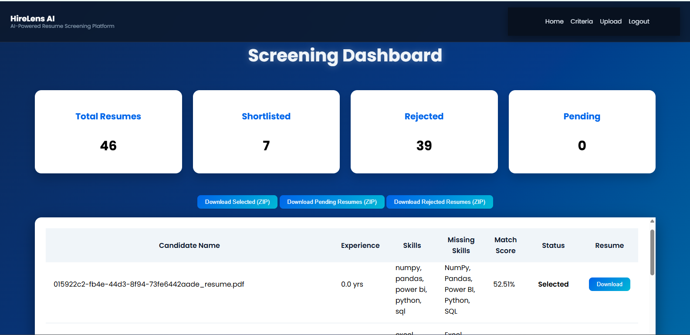

# HireLens AI - AI-Powered Resume Screening Platform

## 1. Project Overview

HireLens AI is a FastAPI-based hiring tool that automates resume screening.  
HRs can upload resumes, set job criteria, and instantly get scored results through a web dashboard.

I built HireLens AI to learn how to ship a real backend that actually works in production. It’s a FastAPI app that serves a simple HTML/CSS/JS frontend, lets an HR define job criteria, upload resumes (PDF/DOCX/TXT/ZIP), scores them, and shows results on a dashboard. I used Supabase for the database and storage, and added OTP email for signup/verification.

Locally everything worked with SMTP, but when I deployed to Render, I learned that outbound SMTP is blocked. My fix was to switch from SMTP to Resend’s HTTP API for sending OTP emails. Now OTP emails work both locally and on Render without any special networking.

Supabase tables I’m using:
- `users` — basic email/password
- `temp_otp` — email + OTP + expiry
- `job_criteria` — saved hiring criteria per HR
- `resumes` — processed resume data, scores, status, storage paths

## 2. Features
- OTP signup and verification
- Save job criteria (skills, min experience, department, min match score)
- Upload single files or a ZIP of multiple resumes
- Auto text extraction, skill matching, experience parsing, JD similarity, and final score
- Supabase Storage for resume files and signed URLs for downloads
- Dashboard with summary, top-selected, and bulk ZIP downloads
- Fully static frontend served by FastAPI (no separate build step)
- Works locally and on Render with environment variables only (no hardcoded secrets)

## 3. Tech Stack
- FastAPI + Uvicorn
- Supabase (authentication, database, storage)
- Resend API for OTP emails (HTTP based)
- HTML, CSS, JavaScript (no framework)
- Deployed on Render (Web Service)

## 4. Project Structure
```
backend/
  main.py
  config.py
  supabase_client.py
  routes/
    auth_routes.py
    criteria_routes.py
    upload_routes.py
    dashboard_routes.py
  utils/
    email_service.py
    supabase_storage.py
    file_handler.py
frontend/
  index.html
  login.html
  signup.html
  otp.html
  input.html
  upload.html
  dashboard.html
  forgot_password.html
  reset_password.html
  Static/
    brand.css
runtime.txt          # python-3.11.9
requirements.txt
```

## 5. Screenshots of important pages

### Home Page


### Signup Page


### OTP Verification


### Input Job Criteria


### Upload Resumes


### Dashboard


## 6. Live Demo
- Render live link: https://hirelens-ai.onrender.com/
- Demo video: https://your-demo-video-link.example.com/

## 7. Environment Variables
Set these in Render (Environment tab or via an Environment Group), and in `.env` for local dev:

- `SUPABASE_URL`
- `SUPABASE_KEY`
- `RESEND_API_KEY`
- `RESEND_FROM_EMAIL`
- `RESEND_FROM_NAME` (optional, defaults to `HireLens AI`)
- `RESEND_BASE_URL` (optional, defaults to `https://api.resend.com`)
- `EMAIL_TIMEOUT` (optional, e.g., `10`)
- `FRONTEND_URL` (set if the frontend is on a different domain)
- `ALLOWED_ORIGINS` (comma-separated list; include your frontend domain if separate)
- `PORT` (Render sets this automatically)

Notes:
- Use Environment Variables or Environment Groups attached to the service (recommended).
- Avoid Secret Files for variables you read via `os.getenv()`.
- Do not wrap values in quotes and avoid trailing spaces.

## 8. Local Setup
1. Clone the repo and create a `.env` file with the variables above.
2. Python version is specified in `runtime.txt` (`python-3.11.9` works well).
3. Install dependencies:
   ```
   pip install -r requirements.txt
   ```
4. Run the app:
   ```
   uvicorn backend.main:app --reload
   ```
   Or:
   ```
   python backend/main.py
   ```
5. Open `http://localhost:8000/` and try the flow: signup → OTP → define criteria → upload → dashboard.

## 9. Render Deployment
1. Create a new Render Web Service from this repository.
2. Add Environment Variables listed above (or attach an Environment Group with them).
3. Set Start Command:
   ```
   uvicorn backend.main:app --host 0.0.0.0 --port $PORT
   ```
4. Deploy and test pages: `/`, `/login`, `/signup`, `/otp`, `/input`, `/upload`, `/dashboard`.

## 10. Common Issues & Fixes
- SMTP blocked on Render:
  - I replaced SMTP with Resend’s HTTP API in `backend/utils/email_service.py`. This works on Render.

- Env variables not picked up:
  - Make sure you used Environment Variables or an attached Environment Group (not Secret Files).
  - Double-check variable names and remove quotes/spaces. Redeploy/restart after changes.

- Sender verification:
  - In Resend, verify the sender email/domain. Without verification, emails may not deliver.

- CORS errors (if frontend is separate):
  - Set `FRONTEND_URL` or `ALLOWED_ORIGINS` to include the frontend domain. The backend uses these to configure CORS.

- Static assets 404:
  - CSS is served at `/styles/brand.css`. The app mounts `/styles`, `/static`, and `/scripts` as available.

## 11. About Me
I’m learning how to build production-focused projects end to end. This repo helped me understand environment variables, third‑party services, and deployment issues that don’t show up locally. If you have feedback or suggestions, I’m happy to hear them.
